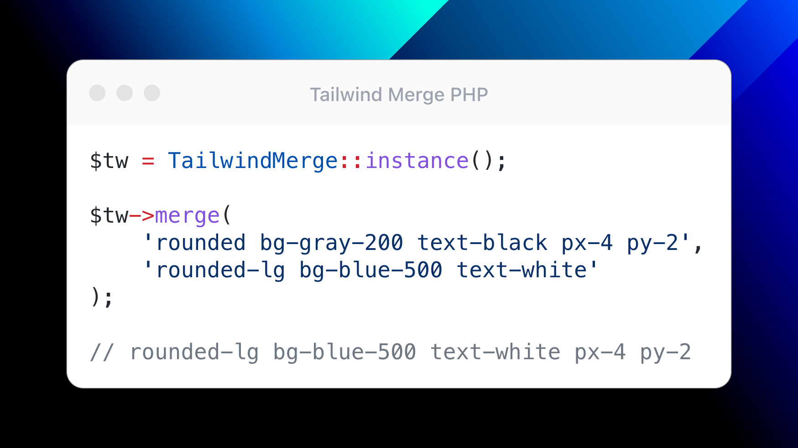

<p align="center"></p>

# Efficiently merge Tailwind CSS classes in PHP without style conflicts

[](https://github.com/yieldstudio/tailwind-merge-php/releases)
[](https://github.com/yieldstudio/tailwind-merge-php/actions/workflows/tests.yml)
[](https://packagist.org/packages/yieldstudio/tailwind-merge-php)

This package allows you to merge multiple [Tailwind CSS](https://tailwindcss.com) classes and automatically resolves conflicts between them without headaches.

tailwind-merge-php is a PHP port of the excellent [tailwind-merge](https://github.com/dcastil/tailwind-merge) created by [dcastil](https://github.com/dcastil).

- Supports Tailwind v3.0 up to v3.3
- First-class support for [Laravel](https://laravel.com/)

## Installation

	composer require yieldstudio/tailwind-merge-php

## Usage

```php
use YieldStudio\TailwindMerge\TailwindMerge;
use YieldStudio\TailwindMerge\TailwindMergeConfig;

// Singleton
$twMerge = TailwindMerge::instance();
$twMerge->merge('w-8 h-8 rounded-full rounded-lg'); // w-8 h-8 rounded-lg

// Custom instance
$twMerge = new TailwindMerge(TailwindMergeConfig::default()); // Config is optional
$twMerge->merge('w-8 h-8 rounded-full rounded-lg'); // w-8 h-8 rounded-lg
```

## Laravel Support


You can publish the configuration file with:

```shell
php artisan vendor:publish --provider="YieldStudio\TailwindMerge\Laravel\TailwindMergeServiceProvider"
```

### Using the `tw` helper

```php
tw('w-8 h-8 rounded-full rounded-lg'); // w-8 h-8 rounded-lg
```
### Using Blade directive

```php
<div @tw('w-8 h-8 rounded-full rounded-lg')></div>

// will be
<div class="w-8 h-8 rounded-lg"></div>
```

### Using Blade components

```php
// avatar.blade.php
<div {{ $attributes->tw('w-8 h-8 rounded-full') }}></div>

// header.blade.php
<x-avatar class="rounded-lg" />

// will be
<div class="w-8 h-8 rounded-lg"></div>
```

## Configuration & plugins

> ✍️ Complete documentation is being written

## Unit tests

To run the tests, just run `composer install` and `composer test`.

## Changelog

Please see [CHANGELOG](CHANGELOG.md) for more information on what has changed recently.

## Contributing

Please see [CONTRIBUTING](https://raw.githubusercontent.com/YieldStudio/.github/main/CONTRIBUTING.md) for details.

### Security

If you've found a bug regarding security please mail [contact@yieldstudio.fr](mailto:contact@yieldstudio.fr) instead of using the issue tracker.

## Credits

- [James Hemery](https://github.com/jameshemery)
- Special thanks to [dcastil](https://github.com/dcastil) who built [tailwind-merge](https://github.com/dcastil/tailwind-merge)


## License

The MIT License (MIT). Please see [License File](LICENSE.md) for more information.
